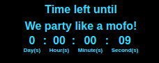
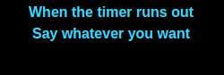
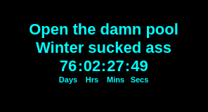
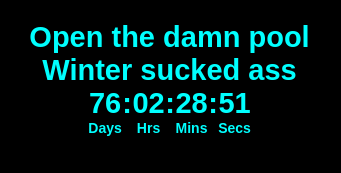

## MMM-EventHorizon

Simple countdown timer for events.

## Examples

* Small, medium and large options

 

 

## Installation

* `git clone https://github.com/mykle1/MMM-EventHorizon` into the `~/MagicMirror/modules` directory.

## Config.js entry and options

```
{
disabled: false,
module: 'MMM-EventHorizon',
position: 'bottom_center',
config: {
    timezone: "n179",                     // See Timezone chart at bottom
    units: "1",          // 1=no units, 2=units initial only, 3=units abbr singular, 4= units abbr plural, 5= units full name
    size: "large",                        // small, medium or large
    countUp: "yes",                       // Count up after timer ends
    date: "2019-07-04",                   // YYYY-MM-DD format ONLY
    time: "00:00:01",                     // (HH:MM:SS)    Exact time you want timer to end
    text1: "Describe event",         // 2 lines of text during timer
    text2: "And here too!",               // 2 lines of text during timer
    text1Color: "FFFFFF",                 // Hex color codes
    text2Color: "62FF00",                 // Hex color codes
    timerColor: "FFFFFF",                 // Hex color codes
    endText1: "When timer ends",          // 2 lines of text when timer ends
    endText2: "Say something here",       // 2 lines of text when timer ends
    endText1Color: "FFFFFF",              // Hex color codes
    endText2Color: "62FF00",              // Hex color codes
    timerUpColor: "FFFFFF",               // Hex color codes
    colorpc: "000",                       // color of the background 000 = black, t = transparent
  }
},
```

Go to this page and obtain your timezone code 
https://forum.magicmirror.builders/topic/9514/contribute-to-a-module-volunteers-wanted-easy

Or choose from the list below!

Or choose from the text file "Timezone codes" included with this module.

## Timezone codes - Added as needed. Please ask at the MagicMirror forum

* France, Paris = n195

* Germany, Berlin = n37

* Norway, Oslo = n187

* Sweden, Stockholm = n239

* Switzerland, Geneva = n87

* UK, London = n136

* USA, CA = n137
* USA, NY = n179
* USA, IL = n64
* USA TX = n70

@vinp - Contributor
* Central Time zone USA (Chicago) = n64

@sdetweil - Contributor
* n64 - Austin, Texas
* n70 - Dallas, Texas
* n104 - Houston, Texas
* n394 - Albuquerque, Nm
* N197 - Phoenix, Az

@rts58 - Contributor
* n43 Boston, MA

@dazza120 - Contributor
* n2483 UK 🇬🇧 England

@CyruS1337 - Contributor
* n268 Zuerich, Switzerland

@Sandy2503 - Contributor
* n959 Wuppertal - Germany - CET - Central European Time

@Sean - Contributor
* n83 - Frankfurt A.M, Germany

@Nilnik - Contributor
* n291, Gothenburg, Sweden

@THeStigh - Contributor
* n290 Tromso - Norway
* n187 Oslo - Norway
* n5267 Finnsnes - Norway
* n287 Bergen - Norway
* n288 Trondheim - Norway
* n289 Stavanger - Norway
* n2513 Alta - Norway

@zdenek - Contributor
* Czech Republic - Liberec - n3673
* Czech Republic - Brno - n1960
* Czech Republic - Praha - n204
* Czech Republic - Plzeň - n2172
* Czech Republic - Hradec Králové - n4344
* Czech Republic - Teplice - n5513
* Czech Republic - Karlovy Vary- n4726
* Czech Republic - Ostrava - n2202
* Czech Republic - Olomouc - n4343
* Czech Republic - Tábor - n2201
* Czech Republic - Ústí nad Labem - n4345

@MWel197 - Contributor
* Netherlands - Arnhem - n1296
* Netherlands - Amsterdam - n16

@qu1que - Contributor
* n681 - A Coruña - Spain
* n3334 - Lugo - Spain
* n4529 - Vigo - Spain
* n141- Madrid - Spain
* n327 - Bilbao - Spain
* n31 - Barcelona - Spain
* n326 - Zaragoza - Spain
* n321- Sevilla - Spain
* n325 - Valencia - Spain
* n683 - Santa Cruz de Tenerife - Spain
* n3751 - Valladolid - Spain

@yawns = Contributor
* n987 Solingen - Germany - CET - Central European Time

@robiv8 = Contributor
* n317 Stuttgart DE Germany CET
* n2390 Split HR Croatia CET
* n281 Zagreb HR Croatia CET

@MyMirror = Contributor
* n307 Hamburg DE Germany

@justjim = Contributor
* Maryville, Missouri – n5345
* Kansas City, Missouri – n405
* Saint Joseph, Missouri – n5688
* Independence, Missouri – n838
* Des Moines, Iowa – n76
* Kansas City, Kansas – n5080
* Overland Park, Kansas – n868

@swvalenti = Contributor
* n2268 Freehold, NJ, USA

@aidandon = Contributor
* n4391 - Northern Ireland

@MoreLinux = Contributor
* n48 - Walldorf (Baden-Württemberg)

@lavolp3 = Contributor
* n1016 - Moers, Germany
* n957 - Duisburg, Germany
* n973 - Krefeld, Germany
* n2011 - Mülheim/Ruhr, Germany

@Anthony = Contributor
* n26 - Greece - Athens

## Special thanks to @spitzlbergerj

For going out of his way and making some nice additions to the module,

Even if he made it work ONLY for Berlin Germany! I kid you not! :-)
